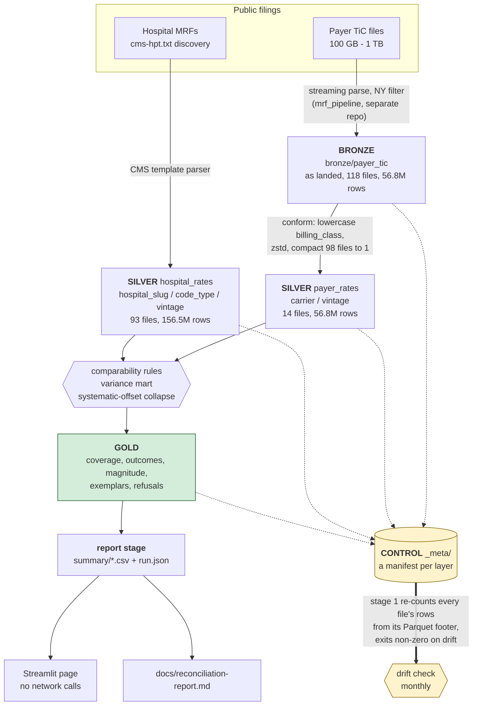

# reckoner

Reconciles **two different federal price transparency disclosures of the same
negotiated rates** for New York hospitals, quantifies where they disagree, and
explains why.

Hospitals publish under the Hospital Price Transparency rule (45 CFR 180).
Insurers publish under Transparency in Coverage. Both describe rates for the same
care at the same facilities, and they do not agree. CMS has formally named the
misalignment between the two as a barrier to price transparency.

This is a personal project — deployed, scheduled, monitored and tested, but
serving no users and supporting no one's decisions.

---

## Start here

**[`docs/silent-failures.md`](docs/silent-failures.md)** — every bug so far that
**reported success and was wrong**, with the check that now catches each one.
Eleven entries: a `write_dataset` call that silently dropped a partition key, a
`str.replace` that did nothing while every gate stayed green, a feature that was
designed and tested and never switched on so two of four systems reconciled
nothing, a gauge that read zero correctly about the wrong thing, and a CLI flag
that silently resized a container to an eighth of its memory. It is the most
useful document in this repository and the reason most of the rest is trustworthy.

### The page

Five views over the published dataset, filterable by health system, carrier and
code type. It reads committed CSV and makes no network calls.


<details>
<summary>The other four views</summary>

| | |
|---|---|
|  |  |
| **Coverage** — the funnel, and the comparable share | **Outcomes** — why pairs differ, by explanation |
|  |  |
| **Magnitude** — how large the surviving disagreements are | **Widest gaps** — the largest, with implausible ones flagged |
|  | |
| **Refusals** — why candidates never became pairs | |

</details>

Deployment steps are in [`docs/streamlit-deploy.md`](docs/streamlit-deploy.md).
Community Cloud sleeps an app after a period without traffic and wakes it on the
next visit, which takes a few seconds; nothing is lost, and the vintages the page
shows are the dataset's, not the wake-up's.

### What actually reconciles

Four of twelve health systems appear in both sources and can be compared at all.

| system | pairs formed | comparable share | residual findings | offsets |
|---|---|---|---|---|
| NYU Langone | 6,539,353 | 3.88% | 86,174 | 176 |
| Northwell | 4,552,693 | 6.23% | 116,504 | 78 |
| Mount Sinai | 3,370,446 | 9.30% | 60,182 | 461 |
| NewYork-Presbyterian | 106,852 | 1.50% | 0 | 5 |

**Read the comparable share, not the pair count.** Between 1.5% and 9.3% of
candidate pairs survive the comparability rules; the rest are refused for stated
reasons, published in `gold/refusals`. The **residual** is the finding: pairs
that are material *and* unexplained after every deterministic rule has had its
say. **Offsets** are contracts where one constant ratio covers many services —
one fact about two base rates, not one finding per code.

---

## The two rules, and why it matters

|  | Hospital (45 CFR 180) | Payer (Transparency in Coverage) |
|---|---|---|
| Who publishes | hospitals | insurers |
| Plans covered | **every** payer and plan the hospital contracts with, including Medicare Advantage, Medicaid managed care and CHP | commercial group and individual **only** — CMS exempts Medicare, MA, Medicaid and Medicaid MCO |
| File size | tens to hundreds of MB | 100 GB to 1 TB+ |
| Updated | at least annually | monthly |

The consequence runs through everything here: **Medicare Advantage and Medicaid
rates exist only in hospital-side files.** Any claim otherwise is a bug.

---

## Architecture

Three storage layers plus a control layer, on ADLS Gen2. Everything else reads
from it; no engine ever holds the only copy.



<details>
<summary>The same thing as plain text, for anywhere Mermaid does not render</summary>

```
  mrf_pipeline (separate repo)              hospital MRFs
  100 GB-1 TB TiC files                     cms-hpt.txt discovery
          │  streaming parse, NY filter             │  CMS template parser
          ▼                                         ▼
  ┌───────────────────────────────────────────────────────────┐
  │  BRONZE   bronze/payer_tic/ingest_date=…/carrier=…        │
  │           as landed, byte-faithful, 118 files             │
  └───────────────────────────────────────────────────────────┘
          │  conform: lowercase billing_class, zstd, compact
          ▼
  ┌───────────────────────────────────────────────────────────┐
  │  SILVER   silver/hospital_rates/hospital_slug/code_type/… │
  │           silver/payer_rates/carrier/vintage              │
  │           conformed, partitioned for the questions asked  │
  └───────────────────────────────────────────────────────────┘
          │  comparability rules, variance mart, offset collapse
          ▼
  ┌───────────────────────────────────────────────────────────┐
  │  GOLD     gold/{coverage,outcomes,magnitude,exemplars,    │
  │           refusals}  — the residual and its denominators  │
  └───────────────────────────────────────────────────────────┘
          │
          ▼
  ┌───────────────────────────────────────────────────────────┐
  │  +1  CONTROL   _meta/…/upload_manifest.json               │
  │      every layer's manifest; the monthly job diffs all    │
  │      four against what is actually there, and exits       │
  │      non-zero when they disagree                          │
  └───────────────────────────────────────────────────────────┘
```

</details>

The control layer is not a storage layer, which is why it is drawn apart. It is the
thing that makes the other three trustworthy: a manifest per layer, and a
scheduled job that re-counts every file's rows from its Parquet footer and fails
loudly when the count has moved. A layer nobody checks is a layer nobody can
cite.

### What is actually in it

| layer | files | size | rows |
|---|---|---|---|
| bronze/payer_tic | 118 | 0.560 GB | 56,784,415 |
| silver/hospital_rates | 93 | 3.749 GB | 156,484,277 |
| silver/payer_rates | 14 | 0.438 GB | 56,784,415 |
| gold (5 tables) | 18 | 0.0001 GB | 365 |
| **total** | **248** | **4.747 GB** | |

Payer silver is 118 files in and 14 out: EmblemHealth arrives as 98 files, one
per plan, and they share a carrier and a vintage, so they become one. Compaction
falls out of the partition key rather than being a pass over the data.

---

## Why the residual is small

**Systematic offsets are the reason.** When two sources use the
same DRG weights and different base rates, the weight cancels and hundreds of
codes come out at one constant ratio. Reported per code it reads as hundreds of
findings; it is one fact about two base rates. Collapsing them turned 2,943
unexplained Mount Sinai pairs into 27 — and chasing the four constants found a
real join defect, where two files each carried two hospitals under a single
label.

---

## Running in the cloud

All East US, in one resource group, on the free tier.

| resource | what | sizing | schedule |
|---|---|---|---|
| ADLS Gen2 `reckonerlake0914` | authoritative store, HNS on | — | — |
| `reckoner-pipeline` | stage 1: diff all four layers against their manifests | 2 vCPU / 4 GiB | `0 6 1 * *` |
| `reckoner-mart` | stage 2: reconcile silver into gold | 4 vCPU / 8 GiB | **manual only** — see below |
| Log Analytics `reckoner-logs` | structured telemetry | 0.5 GB/day cap, 31-day retention | — |

Authentication is a user-assigned managed identity, named explicitly rather than
discovered. **No key, SAS token or connection string exists in this repository or
in the image.**

### Cost

| meter | month to date |
|---|---|
| Storage (writes, reads, capacity) | $0.0153 |
| Log Analytics ingestion | $0.0000 |
| Bandwidth | $0.0000 |
| Container Apps — vCPU, memory, **and environment management** | **no meter at all** |
| Fabric capacity probes (created and deleted in error; see ADR 0004) | $0.0177 |
| **total** | **$0.033** |

4.747 GB against a 5 GB free tier. Container Apps executions fall inside the
monthly free grant of 180,000 vCPU-seconds and 360,000 GiB-seconds — a manifest
run uses 0.04% of it. The $0.10/hour environment management meter does not apply,
confirmed against the invoice rather than inferred from configuration: Cost
Management returns **no Container Apps meter of any kind**, and zero-cost meters
do appear in that output, so the absence is real.

### Honest status: the cloud mart

The `mart` stage is correct and completes **locally**; the gold layer above was
produced by a local run. It has **never completed in a container**. Four
executions were OOM-killed, at 4 GiB and again at 8 GiB — the Consumption profile
ceiling, with no larger machine to move to.

A single slice of 395,462 payer rates reaches 7.1 GB, which those objects cannot
account for, and the cause is not yet known. Four structural reductions took the
peak from 9,808 MiB to 3,031 and none of them was enough. The schedule has been
removed rather than left to fail monthly, because a false alarm every month
teaches whoever reads it to ignore the real one.

Tracked in [issue #47](https://github.com/erjonb19/reckoner/issues/47). The next
step is a `tracemalloc` profile, not another structural guess.

This is the one place where what is deployed and what produced the data differ,
so it is stated here rather than left to be discovered.

---

## Documentation

- [`docs/silent-failures.md`](docs/silent-failures.md) — see **Start here**.
- [`docs/reconciliation-report.md`](docs/reconciliation-report.md) — the written
  report, generated from gold by the report stage.
- [`docs/streamlit-deploy.md`](docs/streamlit-deploy.md) — how the page is
  deployed, and why its Secrets box stays empty.
- [`docs/BUILT_VS_PLANNED.md`](docs/BUILT_VS_PLANNED.md) — built / scaffolded /
  not started. Check here before believing a claim made anywhere else.
- [`docs/adr/`](docs/adr/) — numbered design decisions, including dropping Fabric
  (ADR 0003) and the orchestration and job sizing (ADR 0004).
- [`docs/coverage.md`](docs/coverage.md), [`docs/scope.md`](docs/scope.md) — the
  coverage matrix and the caveats, including negative results: two plausible
  explanations for the cross-source gap that the data disproved.
- [`CLAUDE.md`](CLAUDE.md) — working context, domain facts, architecture rules.

## Running it

```bash
python -m payer.contract --payer-root ../mrf_pipeline/payer_parquet  # the boundary contract
python -m storage.publish --all --root data/lake                     # hospital silver
python -m storage.publish --payer --ingest-date 2026-09-13           # payer silver
python -m reckoner_job --stage manifest                              # drift check, all four layers
python -m reckoner_job --stage mart                                  # reconcile into gold
```

909 tests, `mypy strict`, `ruff`, CI gating every push. Parser tests are built
from real files, not from the CMS spec.

The parser lives in a separate repository (`mrf_pipeline`) and writes the payer
Parquet this one reads. The boundary between them is a declared contract
(`src/payer/contract.py`) rather than an assumption — a column the parser had
been writing for months went unused while the reader fell back to a hardcoded
date map covering 10% of the files, and the contract exists so that cannot recur.
