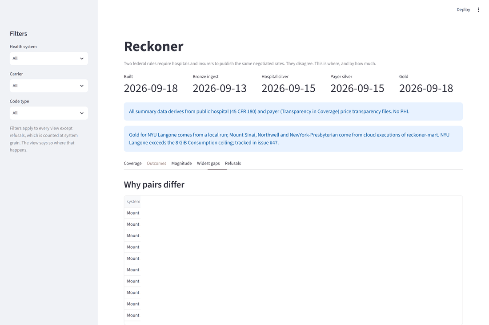
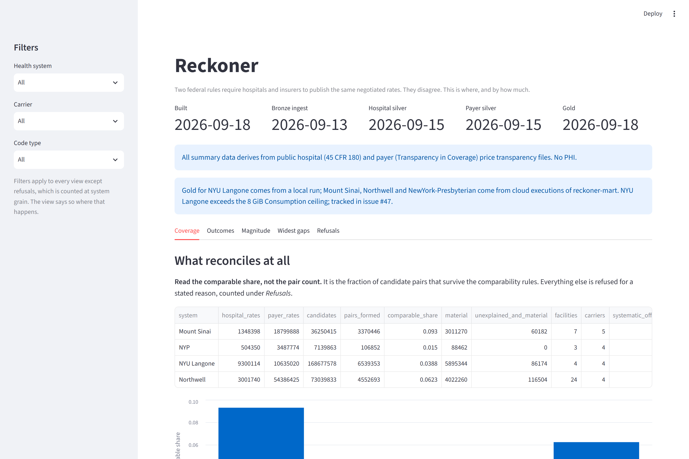
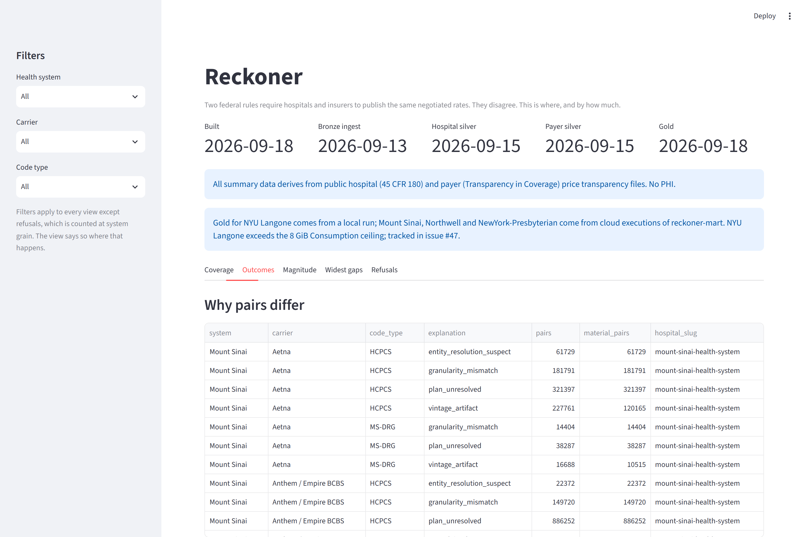
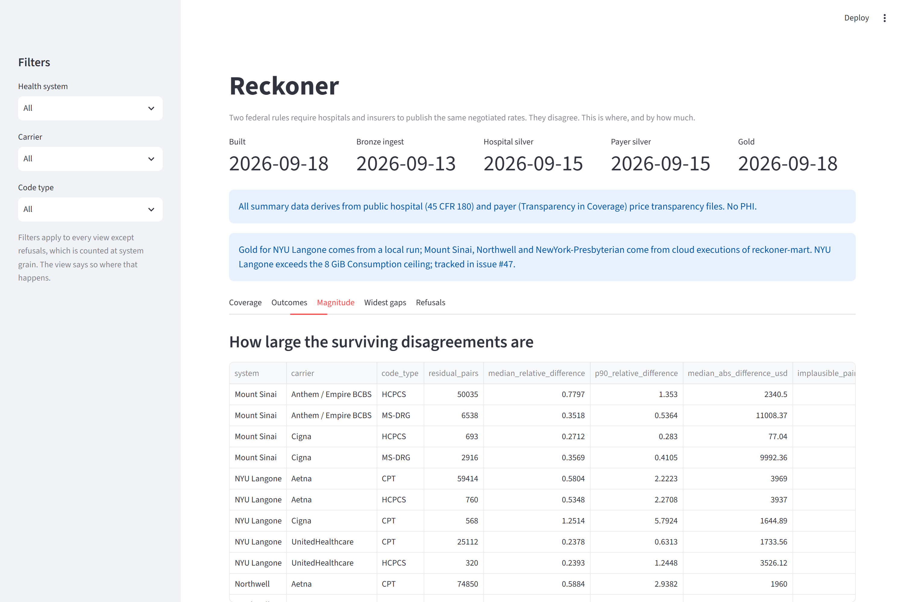
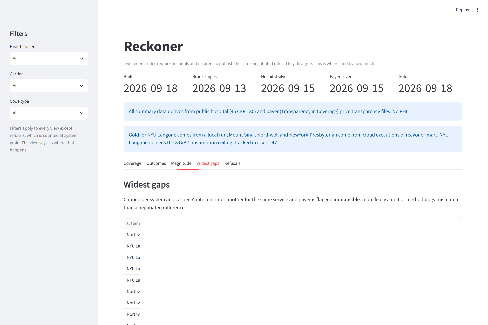
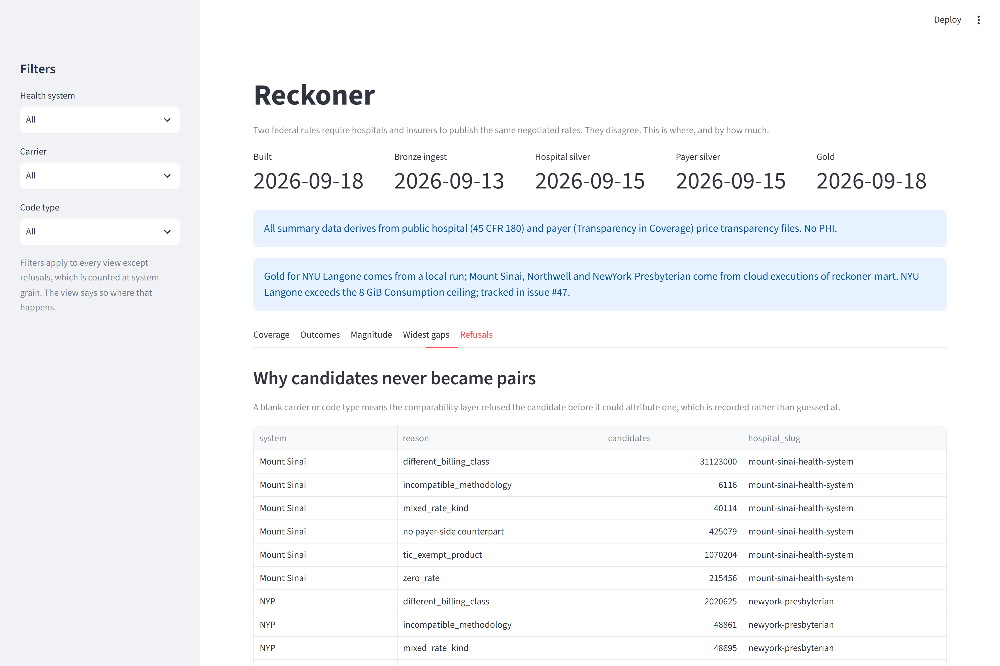

# reckoner

Reconciles **two different federal price transparency disclosures of the same
negotiated rates** for New York hospitals, quantifies where they disagree, and
explains why.

Hospitals publish under the Hospital Price Transparency rule (45 CFR 180).
Insurers publish under Transparency in Coverage. Both describe rates for the same
care at the same facilities, and they do not agree. CMS has formally named the
misalignment between the two as a barrier to price transparency.

This is a personal project — deployed, scheduled, monitored and tested, but
serving no users and supporting no one's decisions.

> **What changed on September 23, 2026.** The unit of every published count moved
> from payer-rate pairs to hospital rates. Billing class is now part of the join
> key ([ADR 0005](docs/adr/0005-billing-class-in-the-join-key.md)), and each hospital
> rate is compared once against the insurer's range of rates for the same service
> ([ADR 0006](docs/adr/0006-compare-against-the-carrier-distribution.md)). Numbers
> from before and after that date are not comparable.

---

## Start here

**[`docs/silent-failures.md`](docs/silent-failures.md)** — every bug so far that
**reported success and was wrong**, with the check that now catches each one.
Fifteen entries: a `write_dataset` call that silently dropped a partition key, a
`str.replace` that did nothing while every gate stayed green, a feature that was
designed and tested and never switched on so two of four systems reconciled
nothing, a gauge that read zero correctly about the wrong thing, a CLI flag
that silently resized a container to an eighth of its memory, a reader that dropped
a column because the first file it opened predated it, and a test fake that
never delivered a filter, so every "filtered" test ran unfiltered, and a
monthly job that would have republished last month's numbers as current, and an
eval that scored 250 calls to a retired model as 250 cautious abstentions. It is the most
useful document in this repository and the reason most of the rest is trustworthy.

### The page

**<https://reckoner-ny.streamlit.app>**

Five views over the published dataset, filterable by health system, carrier and
code type. It reads committed CSV and makes no network calls.



<details>
<summary>The other four views</summary>

| | |
|---|---|
|  |  |
| **Coverage** — the funnel, and the comparable share | **Outcomes** — why pairs differ, by explanation |
|  |  |
| **Magnitude** — how large the surviving disagreements are | **Widest gaps** — the largest, with implausible ones flagged |
|  | |
| **Refusals** — why candidates never became pairs | |

</details>

Community Cloud **sleeps the app after a period without traffic** and wakes it on
the next visit, which takes a few seconds. Nothing is lost, and the vintages the
page shows are the dataset's rather than the wake-up's. Deployment steps are in
[`docs/streamlit-deploy.md`](docs/streamlit-deploy.md).

### What actually reconciles

All seven systems that appear in both disclosures reconcile, every one of them
published by the cloud job. Each hospital rate is compared once, against the
insurer's range of rates for the same service at the same facility, setting and
billing class (ADR 0005, ADR 0006).

| system | hospital rates | compared | raw share | like-class share | residual | offsets |
|---|---:|---:|---:|---:|---:|---:|
| Mount Sinai | 1,348,398 | 625,523 | 46.39% | 47.67% | 54,637 | 29 |
| WMC | 170,710 | 58,238 | 34.12% | 34.12% | 0 | 77 |
| NYU Langone | 9,300,114 | 2,000,760 | 21.51% | 26.02% | 50,300 | 88 |
| White Plains | 350,530 | 66,542 | 18.98% | 19.75% | 212 | 10 |
| Montefiore | 2,597,798 | 427,064 | 16.44% | 17.17% | 3,760 | 3 |
| Northwell | 3,001,740 | 426,316 | 14.20% | 16.89% | 62,169 | 16 |
| NewYork-Presbyterian | 504,350 | 18,387 | 3.65% | 3.83% | 0 | 1 |
| **all seven** | **17,273,640** | **3,622,830** | **20.97%** | **24.15%** | **171,078** | |

**Read the shares, not the counts.** The raw share is over every hospital rate;
the like-class share leaves out rates whose only counterparts were the other
billing class, a facility charge against a professional fee. Both are shown for
this release. The rest are refused for stated reasons, published in
`gold/refusals`. The **residual** is the finding: rates that are material *and*
unexplained after every deterministic rule, including the new one, that the
hospital's rate sits inside the insurer's own published range. **Offsets** are
contracts where one constant ratio covers many services: one fact about two base
rates, not one finding per code.

These figures are not comparable with anything published before 2026-09-23. The
unit changed from one pair per payer rate to one comparison per hospital rate,
which removed a fan-out of up to 290 comparisons per rate.

### What is actually in it

| layer | files | size | rows |
|---|---|---|---|
| bronze/payer_tic | 118 | 0.560 GB | 56,784,415 |
| silver/hospital_rates | 93 | 3.749 GB | 156,484,277 |
| silver/payer_rates | 14 | 0.438 GB | 56,784,415 |
| gold (5 tables) | 18 | 0.0001 GB | 365 |
| **total** | **248** | **4.747 GB** | |

Payer silver is 118 files in and 14 out: EmblemHealth arrives as 98 files, one
per plan, and they share a carrier and a vintage, so they become one. Compaction
falls out of the partition key rather than being a pass over the data.

---

## Why the residual is small

**Systematic offsets are the reason.** When two sources use the
same DRG weights and different base rates, the weight cancels and hundreds of
codes come out at one constant ratio. Reported per code it reads as hundreds of
findings; it is one fact about two base rates. Collapsing them turned 2,943
unexplained Mount Sinai pairs into 27 — and chasing the four constants found a
real join defect, where two files each carried two hospitals under a single
label.

### What survives: A1 triage, scored against 250 human labels

| triager | precision | coverage | human queue | cost |
|---|---|---|---|---|
| deterministic rules | 0.000 | 0.884 | 0 | $0 |
| A1 agent (Gemini 2.5 Flash, free tier) | not yet run | | | |

The gate is precision 0.90; neither triager may write a cause into a report
until it passes. 210 of the 250 labels are one cause, units or methodology
(mostly component-versus-facility pricing), so a score on this queue mostly
measures that one skill; [`docs/labelling-a1.md`](docs/labelling-a1.md) explains
this, and why the rules score zero.

The agent runs on **Gemini 2.5 Flash on the Gemini API free tier**, so it bills
$0. The cost column will show the paid tier's list-price equivalent, to keep it
comparable. The score belongs to that model: a different model is a different
result.

---

## Running in the cloud

All East US, in one resource group, on the free tier.

| resource | what | sizing | schedule |
|---|---|---|---|
| ADLS Gen2 `reckonerlake0914` | authoritative store, HNS on | — | — |
| `reckoner-pipeline` | stage 1: diff all four layers against their manifests | 2 vCPU / 4 GiB | `0 6 1 * *` |
| `reckoner-mart` | stage 2: reconcile silver into gold | 4 vCPU / 8 GiB | **manual only** — see below |
| Log Analytics `reckoner-logs` | structured telemetry | 0.5 GB/day cap, 31-day retention | — |

Authentication is a user-assigned managed identity, named explicitly rather than
discovered. **No key, SAS token or connection string exists in this repository or
in the image.**

### Cost

| meter | month to date |
|---|---|
| Storage (writes, reads, capacity) | $0.0153 |
| Log Analytics ingestion | $0.0000 |
| Bandwidth | $0.0000 |
| Container Apps — vCPU, memory, **and environment management** | **no meter at all** |
| Fabric capacity probes (created and deleted in error; see ADR 0004) | $0.0177 |
| **total** | **$0.033** |

5.282 GB against a 5 GB free tier: 0.282 GB over, about 0.6 cents a month. Container Apps executions fall inside the
monthly free grant of 180,000 vCPU-seconds and 360,000 GiB-seconds — a manifest
run uses 0.04% of it. The $0.10/hour environment management meter does not apply,
confirmed against the invoice rather than inferred from configuration: Cost
Management returns **no Container Apps meter of any kind**, and zero-cost meters
do appear in that output, so the absence is real.

### Status: the cloud mart

Every system's gold is now produced by the `reckoner-mart` job in a container.
Until 2026-09-23 NYU Langone's came from a local run and Montefiore had none.
Both were OOM-killed at the 8 GiB Consumption ceiling. A per-step memory profile
in the container found the cause. The hospital-side aggregate kept a t-digest
per group, allocated outside Arrow's memory pool, about 6 GB for 586,207
groups. An exact median replaced it (#83), and the same shard load fell from
8,028 MiB to 1,634. The largest system now peaks near 4.3 GB.

The monthly schedule is back (`0 8 1 * *`). **One thing is untested:** the
scheduled run does all seven systems in one execution. Per system they sum to
about 87 minutes against a 180-minute timeout, and memory carried from one
system to the next hasn't been measured. The first real run is 1 October. If it
fails, gold is untouched, because the mart writes only at the end, and the
workbook's run history shows it.

Rebuilding every system twice on 2026-09-23 used about 84% of September's
Container Apps free grant (≈150,500 of 180,000 vCPU-seconds, measured from log
spans, so a slight undercount). That's still inside it, but it is the month's
budget, not a rounding error.

---

## Documentation

- [`docs/silent-failures.md`](docs/silent-failures.md) — see **Start here**.
- [`docs/reconciliation-report.md`](docs/reconciliation-report.md) — the written
  report, generated from gold by the report stage.
- [`docs/streamlit-deploy.md`](docs/streamlit-deploy.md) — how the page is
  deployed, and why its Secrets box stays empty.
- [`docs/BUILT_VS_PLANNED.md`](docs/BUILT_VS_PLANNED.md) — built / scaffolded /
  not started. Check here before believing a claim made anywhere else.
- [`docs/refusal-decomposition.md`](docs/refusal-decomposition.md) — why 79% of
  hospital rates are never compared, by reason, system and carrier, and which fixes
  could move that. Most can't: TiC-exempt products and carriers outside the payer
  corpus are refused correctly. The largest fixable lever is payer-name matching.
- [`docs/plan-matching.md`](docs/plan-matching.md) — what fuzzy plan matching buys,
  measured before anything depends on it: +0.86 points of plan coverage, and 0.00
  of comparable share.
- [`docs/labelling-a1.md`](docs/labelling-a1.md) — how to fill the label file A1's
  eval reads. It ships empty, and the eval says "not measured" until it isn't.
- [`docs/adr/`](docs/adr/README.md) — numbered design decisions, with an index and
  the open decisions that don't have a record yet.
- [`docs/coverage.md`](docs/coverage.md), [`docs/scope.md`](docs/scope.md) — the
  coverage matrix and the caveats, including negative results: two plausible
  explanations for the cross-source gap that the data disproved.
- [`CLAUDE.md`](CLAUDE.md) — working context, domain facts, architecture rules.

## Running it

```bash
python -m payer.contract --payer-root ../mrf_pipeline/payer_parquet  # the boundary contract
python -m storage.publish --all --root data/lake                     # hospital silver
python -m storage.publish --payer --ingest-date 2026-09-13           # payer silver
python -m reckoner_job --stage manifest                              # drift check, all four layers
python -m reckoner_job --stage mart                                  # reconcile into gold
```

909 tests, `mypy strict`, `ruff`, CI gating every push. Parser tests are built
from real files, not from the CMS spec.

The parser lives in a separate repository (`mrf_pipeline`) and writes the payer
Parquet this one reads. The boundary between them is a declared contract
(`src/payer/contract.py`) rather than an assumption — a column the parser had
been writing for months went unused while the reader fell back to a hardcoded
date map covering 10% of the files, and the contract exists so that cannot recur.
